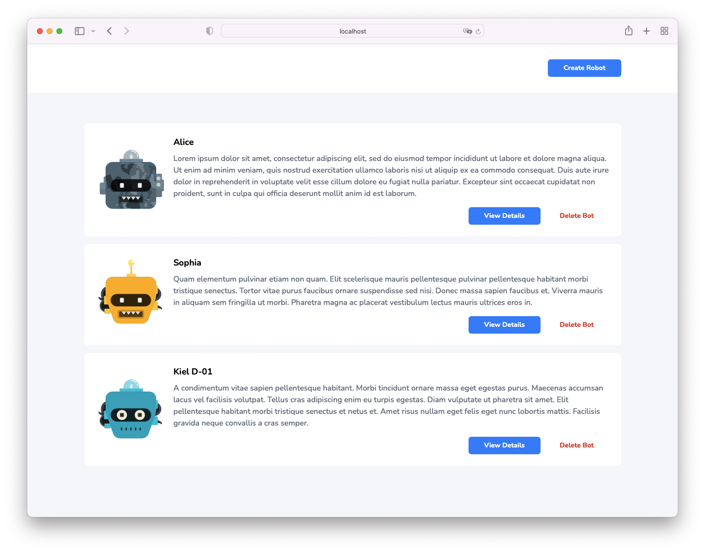
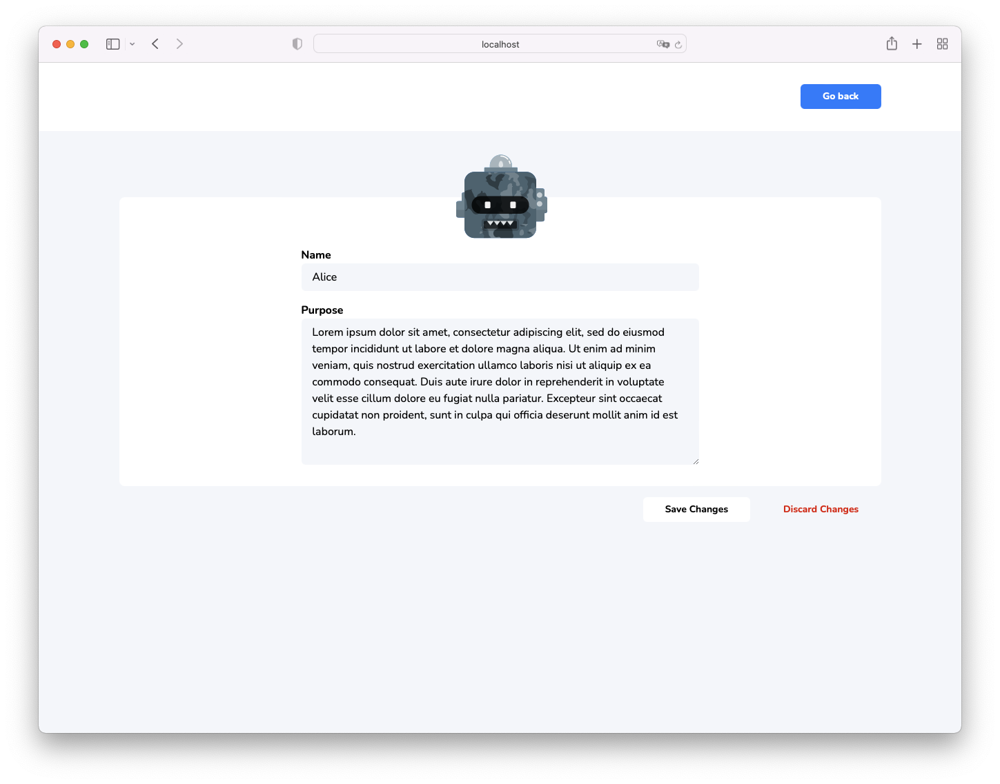
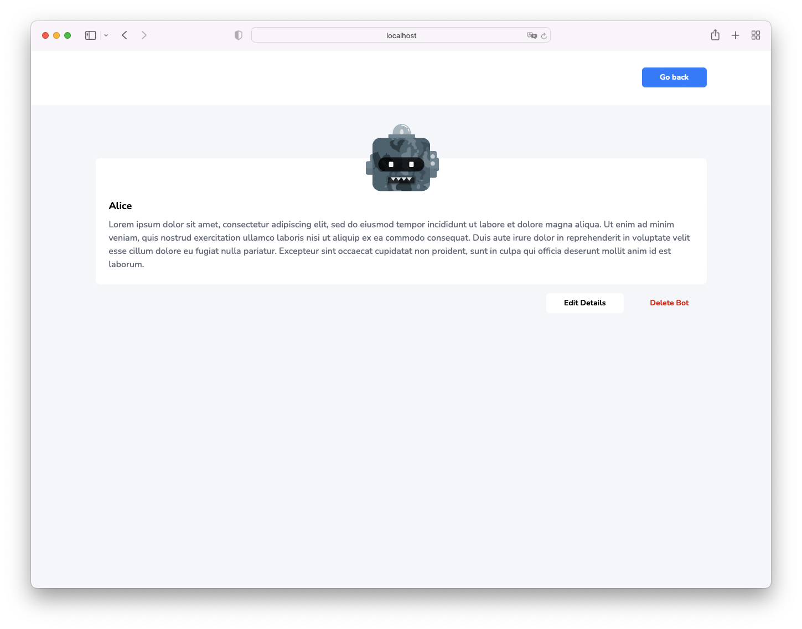
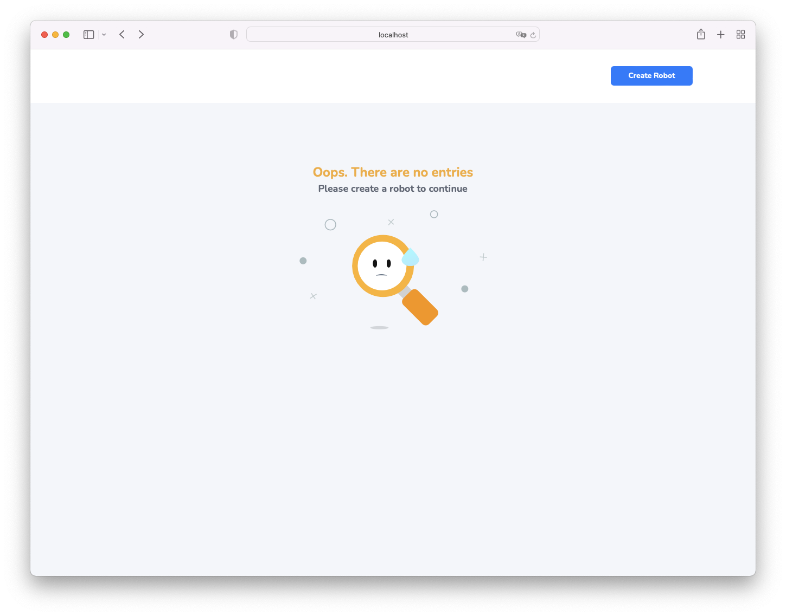

# Robots Catalog

A micro web app for displaying robots

## Table of Contents

- [Robots Catalog](#robots-catalog)
  - [Table of Contents](#table-of-contents)
  - [Preview](#preview)
  - [Technologies Used](#technologies-used)
  - [Requirements](#requirements)
  - [Installation](#installation)
  - [Starting the server](#starting-the-server)
  - [Starting the server using Docker](#starting-the-server-using-docker)
  - [Author](#author)

## Preview

### Home Page



### Edit Page



### Details Page



### Empty Page



## Technologies Used

- ReactJS
- Typescript
- Redux Toolkit
- TailwindCSS
- Lottie
- Docker

## Requirements

- node.js v17 (17.0.1 recommended)
- npm v8 (8.1.0 recommended)
- Docker (optional)

## Installation

### 1. Install the node dependencies

```bash
# in root project directory
npm install # or yarn install
```

### 2. Setup done

## Starting the server

### 1. In a terminal, execute the command `npm start` or `yarn start`

### 2. Using a browser, visit `http://localhost:3000`

## Starting the server using Docker

### 1. Build docker image

```bash
docker build -t bot-directory .
```

### 2. Run docker image

```bash
docker run -dp 3000:3000 bot-directory
```

## Author

Kristian Espina
